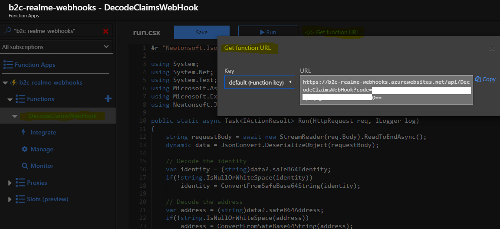

# Decoding the Safe Base64 Identity/Address

The RealMe Assertion service returned the identity safe base64 encoded.

The Identity Experience Framework (IEF) that underlies Azure Active Directory B2C (Azure AD B2C) enables the identity developer to integrate an interaction with a RESTful API in a user journey.

The scenario is that when a user performs a login, we want to:

- Get the safe base 64 identity and/or address from the assertion service.
- Decode these values.
- Return these attributes to the application as a claim.

### 1. Prepare the REST API function

> Setup of REST API functions is outside the scope of this article. [Azure Functions](https://docs.microsoft.com/en-us/azure/azure-functions/functions-reference) provides an excellent toolkit to create RESTful services in the cloud.

We have set up an Azure function that receives two claims (called `encodedIdentity` and `encodedAddress`), and then returns the claims `decodedIdentity` and `decodedAddress` which are the decoded values of the input claims. The sample Azure function can be found [here](./AzureFunctionsSamples/ReadMe.md).

The `encodedIdentity` and `encodedAddress` claims are optional so the `decodedIdentity` and `decodedAddress` will only be returned if the input claims have been sent.

```C#
string requestBody = await new StreamReader(req.Body).ReadToEndAsync();
dynamic inputClaims = JsonConvert.DeserializeObject(requestBody);

var decodedIdentity = string.Empty;
var decodedAddress = string.Empty;

// Decode the identity
if(inputClaims?.encodedIdentity != null)
    decodedIdentity = ConvertFromSafeBase64String((string)inputClaims?.encodedIdentity);

// Decode the address
if(inputClaims?.encodedAddress != null)
    decodedAddress = ConvertFromSafeBase64String((string)inputClaims?.encodedAddress);

// Return the result
return new OkObjectResult(new {decodedIdentity, decodedAddress});
```

An Azure function app makes it easy to get the function URL, which includes the identifier of the specific function. After deploying your azure function, grab the function url: you can use it for testing:



### 2. Configure the RESTful API claims exchange as a technical profile in your TrustFrameworExtensions.xml file

A technical profile is the full configuration of the exchange desired with the RESTful service. Open the TrustFrameworkExtensions.xml file and add the following XML snippet inside the `<ClaimsProviders>` element.

```xml
<ClaimsProvider>
  <DisplayName>REST APIs</DisplayName>
  <TechnicalProfiles>
    <TechnicalProfile Id="AzureFunctions-DecodeRealMeClaimsWebHook">
      <DisplayName>Decode RealMe Claims Web Hook Azure Function</DisplayName>
      <Protocol Name="Proprietary" Handler="Web.TPEngine.Providers.RestfulProvider, Web.TPEngine, Version=1.0.0.0, Culture=neutral, PublicKeyToken=null" />
      <Metadata>
        <Item Key="ServiceUrl">{{azure function url}}</Item>
        <Item Key="AuthenticationType">None</Item>
        <Item Key="SendClaimsIn">Body</Item>
      </Metadata>
      <InputClaims>
        <InputClaim ClaimTypeReferenceId="safeB64Identity" PartnerClaimType="encodedIdentity" />
        <InputClaim ClaimTypeReferenceId="safeB64Address" PartnerClaimType="encodedAddress" />
      </InputClaims>
      <OutputClaims>
        <OutputClaim ClaimTypeReferenceId="identity" PartnerClaimType="decodedIdentity" />
        <OutputClaim ClaimTypeReferenceId="address" PartnerClaimType="decodedAddress" />
      </OutputClaims>
      <UseTechnicalProfileForSessionManagement ReferenceId="SM-Noop" />
    </TechnicalProfile>
  </TechnicalProfiles>
</ClaimsProvider>
```

Replace `{{azure function url}}` with your function url

The `<InputClaims>` element defines the claims that will be sent from the IEF to the REST service. In this example, the contents of the claim `safeB64Identity` will be sent to the REST service as the claim `encodedIdentity`.

The `<OutputClaims>` element defines the claims that the IEF will expect from the REST service. Regardless of the number of claims that are received, the IEF will use only those identified here. In this example, a claim received as `decodedIdentity` will be mapped to an IEF claim called `identity`.

### 3. Add new claims `identity` and `address` to the schema of your TrustFrameworkExtensions.xml file

The claims `identity` and `address` are not yet defined anywhere in our schema. So, add a definition inside the element <BuildingBlocks>. You can find this element at the beginning of the TrustFrameworkExtensions.xml file.

```xml
<BuildingBlocks>
  <ClaimsSchema>
    <ClaimType Id="identity">
      <DisplayName>RealMe Verified Identity</DisplayName>
      <DataType>string</DataType>
      <UserHelpText />
      <UserInputType>TextBox</UserInputType>
    </ClaimType>
    <ClaimType Id="address">
      <DisplayName>RealMe Verified Address</DisplayName>
      <DataType>string</DataType>
      <UserHelpText />
      <UserInputType>TextBox</UserInputType>
    </ClaimType>
  </ClaimsSchema>
</BuildingBlocks>
```

### 4. Include the REST service claims exchange as an orchestration step in your realme assertion user journey in TrustFrameworkExtensions.xml

Add a step to the SignUpSignInRealMeAssertion user journey, after the user has been authenticated (orchestration steps 1-2).

```xml
<OrchestrationStep Order="3" Type="ClaimsExchange">
    <ClaimsExchanges>
        <ClaimsExchange Id="DecodeRealMeClaims" TechnicalProfileReferenceId="AzureFunctions-DecodeRealMeClaimsWebHook" />
    </ClaimsExchanges>
</OrchestrationStep>
```

> If the order does not match your version, make sure that you insert the code as the step before the `ClaimsExchange` type `SendClaims`.

The final XML for the user journey should look like this:

```xml
<UserJourney Id="SignUpSignInRealMeAssertion">
    <OrchestrationSteps>
      <OrchestrationStep Order="1" Type="CombinedSignInAndSignUp">
        <ClaimsProviderSelections>
          <ClaimsProviderSelection TargetClaimsExchangeId="RealMeExchange" />
        </ClaimsProviderSelections>
      </OrchestrationStep>
      <OrchestrationStep Order="2" Type="ClaimsExchange">
        <ClaimsExchanges>
          <ClaimsExchange Id="RealMeExchange" TechnicalProfileReferenceId="RealMeAssertion-SAML2" />
        </ClaimsExchanges>
      </OrchestrationStep>
      <OrchestrationStep Order="3" Type="ClaimsExchange">
        <ClaimsExchanges>
          <ClaimsExchange Id="DecodeRealMeClaims" TechnicalProfileReferenceId="AzureFunctions-DecodeRealMeClaimsWebHook" />
        </ClaimsExchanges>
      </OrchestrationStep>
      <OrchestrationStep Order="4" Type="ClaimsExchange">
        <ClaimsExchanges>
          <ClaimsExchange Id="AADUserReadUsingAlternativeSecurityId" TechnicalProfileReferenceId="AAD-UserReadUsingAlternativeSecurityId-NoError" />
        </ClaimsExchanges>
      </OrchestrationStep>
      <OrchestrationStep Order="5" Type="ClaimsExchange">
        <Preconditions>
          <Precondition Type="ClaimsExist" ExecuteActionsIf="true">
            <Value>objectId</Value>
            <Action>SkipThisOrchestrationStep</Action>
          </Precondition>
        </Preconditions>
        <ClaimsExchanges>
          <ClaimsExchange Id="AADUserWrite" TechnicalProfileReferenceId="AAD-UserWriteUsingAlternativeSecurityId" />
        </ClaimsExchanges>
      </OrchestrationStep>
      <OrchestrationStep Order="6" Type="SendClaims" CpimIssuerTechnicalProfileReferenceId="JwtIssuer" />
    </OrchestrationSteps>
    <ClientDefinition ReferenceId="DefaultWeb" />
  </UserJourney>
</UserJourneys>
```

### 5. Add the claims `identity` and `address` to your relying party policy file so the claim is sent to your application

Edit your *SignUpSignInRealMeAssertion.xml* relying party (RP) file and modify the `<TechnicalProfile Id="PolicyProfile">` element to add the following elements:

```xml
<OutputClaim ClaimTypeReferenceId="identity" />
<OutputClaim ClaimTypeReferenceId="address" />
```

### 6. Upload your changes and test

Overwrite the existing versions of the policy.

1. (Optional:) Save the existing version (by downloading) of your extensions file before you proceed. To keep the initial complexity low, we recommend that you do not upload multiple versions of the extensions file.
2. (Optional:) Rename the new version of the policy ID for the assertion service file by changing `PolicyId="B2C_1A_SignUpSignInRealMeAssertion"`.
3. Upload the extensions file.
4. Upload the policy edit RP file.
5. Use **Run Now** to test the policy. Review the token that the IEF returns to the application.

If everything is set up correctly, the token will include the new claims `identity` and `address`.
